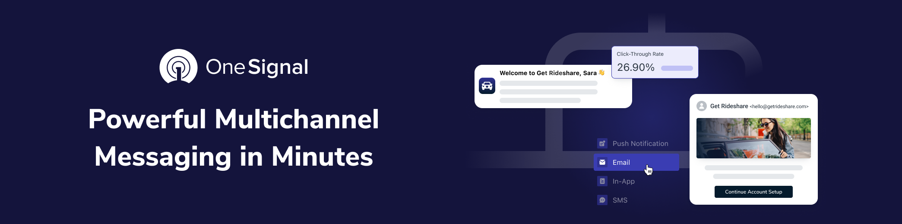

  <a href="https://documentation.onesignal.com/docs/onboarding-with-onesignal" target="_blank">Quickstart</a>
  &nbsp;&nbsp;•&nbsp;&nbsp;
  <a href="https://onesignal.com/" target="_blank">Website</a>
  &nbsp;&nbsp;•&nbsp;&nbsp;
  <a href="https://documentation.onesignal.com/docs" target="_blank">Docs</a>
  &nbsp;&nbsp;•&nbsp;&nbsp;
  <a href="https://github.com/OneSignalDevelopers" target="_blank">Examples</a>
   
  

# OneSignal Go API Sample

OneSignal makes engaging customers simple and is the fastest, most reliable service to send push notifications, in-app messages, SMS, and emails.

This project demonstrates sending push notifications using the OneSignal Go API client. You can use this project as a boilerplate or reference to start your project.

## 🚦 Getting started

This project assumes that you already have a OneSignal app created with push notifications setup. If you don't yet have a OneSignal app, [create one](https://documentation.onesignal.com/docs/apps-organizations#create-an-app) first, then follow the steps to integrate the OneSignal SDK into your [Android](https://documentation.onesignal.com/docs/android-sdk-setup) or [iOS](https://documentation.onesignal.com/docs/ios-sdk-setup) app.

### Steps

1. Make a copy of `.env.example` and rename it to `.env`
2. Replace the variable descriptions with its respective value from your OneSignal app on the dashboard.
3. Run the command `go run .`

# Support

## Ask a question about OneSignal

You can ask questions about the OneSignal xxx SDK and related topics in the onesignal-xxx-sdk repository.

🙋‍♂️ [Ask a question](https://github.com/OneSignal/onesignal-go-api/issues/new?assignees=&labels=triage&template=ask-question.yml&title=%5Bquestion%5D%3A+)

## Create a bug report

If you receive an error message or get blocked by an issue, please create a bug report!

🪳 [Create bug report](https://github.com/OneSignal/onesignal-go-api/issues/new?assignees=&labels=bug%2Ctriage&template=bug-report.yml&title=%5BBug%5D%3A+)

# ❤️ Developer Community

For additional resources, please join the [OneSignal Developer Community](https://onesignal.com/onesignal-developers).

Get in touch with us or learn more about OneSignal through the channels below.

- [Follow us on Twitter](https://twitter.com/onesignaldevs) to never miss any updates from the OneSignal team, ecosystem & community
- [Join us on Discord](https://discord.gg/EP7gf6Uz7G) to be a part of the OneSignal Developers community, showcase your work and connect with other OneSignal developers
- [Read the OneSignal Blog](https://onesignal.com/blog/) for the latest announcements, tutorials, in-depth articles & more.
- [Subscribe to us on YouTube](https://www.youtube.com/channel/UCe63d5EDQsSkOov-bIE_8Aw/featured) for walkthroughs, courses, talks, workshops & more.
- [Follow us on Twitch](https://www.twitch.tv/onesignaldevelopers) for live streams, office hours, support & more.

## Show your support

Give a ⭐️ if this project helped you, and watch this repo to stay up to date.
